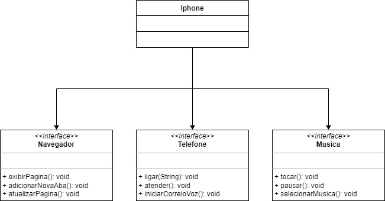

## POO - Desafio

### Modelagem e diagramação da representação em UML e Código no que se refere ao componente iPhone.
Com base no vídeo de lançamento do iPhone foi elaborado a diagramação das classes e interfaces com a proposta de representar os papéis do iPhone de: Reprodutor Musicial, Aparelho Telefônico e Navegador na Internet. Em seguida criou-se as classes e interfaces no formato de arquivos .java.

Projeto desenvolvido com IDE NetBeans.

### UML - Iphone

